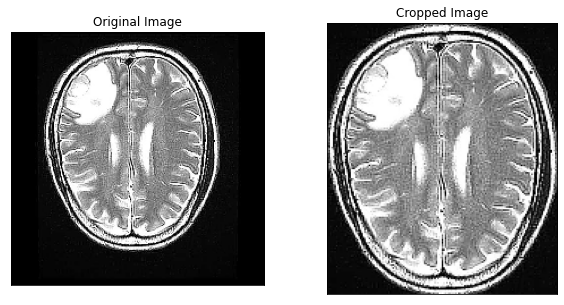
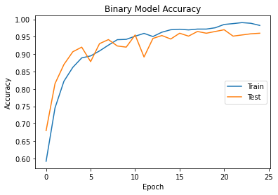
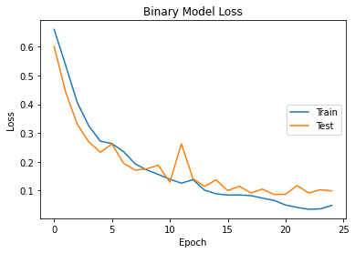
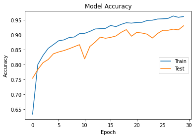
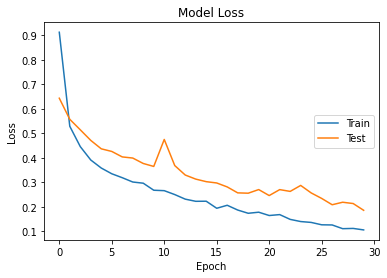
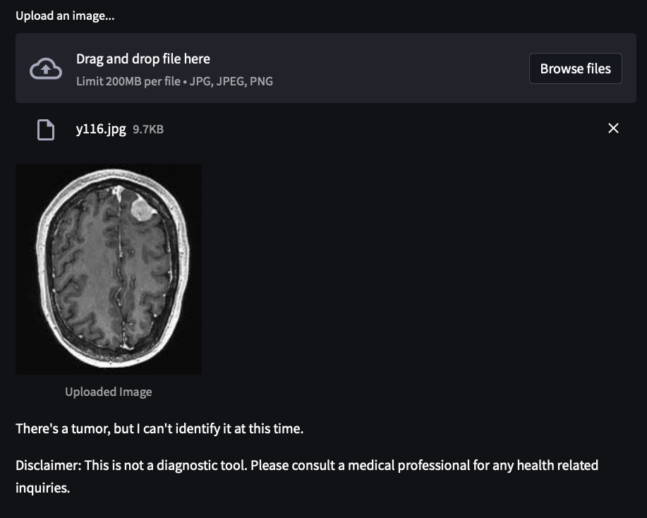

# Brain Tumor Image Classification

This project was made in loving memory of my grandmother, Donna Leung.

##### **Note**: There are images of brain tumors of various anonymous people used in this project and a couple examples in this Read Me. If this is uncomfortable for you, please do not expand the collapsed images.

## Table of Contents
* [Summary](#Summary)
* [Data Collection](#Data_Collection)
* [Exploratory Data Analysis](#Exploratory_Data_Analysis)
    * [Model Parameters](#Model_Parameters)
* [Final Models](#Final_Models)
* [Conclusions](#Conclusions)
* [Next Steps](#Next_Steps)
* [References](#References)

## Summary

In this project, I create Convolutional Neural Network (CNN) models to explore the feasibility of two tasks: first a binary classification model to identify if a tumor is present in an MRI brain scan image and second a multiclass model to attempt to identify the tumor present, if any. I explore different hyperparameters, adjust the images, and utilize transfer learning with the pretrained learning model VGG16. Ultimately I wish to use these models to build an application wherein the final binary classification model flags whether or not a tumor is present and the multiclass model identifies the tumor present or lack thereof. My hope is to one day deploy this model as a diagnostic aid for health care professionals and this is the first step of many in this pursuit. 

## Data Collection

There is no shortage of MRI scans on the internet available for download. There is a difficulting in screening the images for useful labels and proper categorization. In order to get a convenient collection of images I am allowed to use, I have sourced image datasets from Kaggle(dot)com. I chose one dataset of 3000 images in which the images are identified as postive (yes) or negative (no) for brain tumors. The second dataset is a multiclass dataset comprised of approximately 7000 images with no tumor, glioma, meningioma, and pituitary. A third dataset of varying clarity and quality is used as a difficult validation data set to similar images that may be produced in a real world environment. 

## Exploratory Data Analysis

Taking a look through the over 10,000 images available I noticed not all of the images contained the actual brain part of the scan in the center of the images and were generally inconsistent with the black space between the actual brain scan and the edges of the image. In order to crop all the images to a consistent format I followed a tutorial on how to capture the outlines of objects in an image and crop it on [PyImage Search Gurus](https://pyimagesearch.com/2016/04/11/finding-extreme-points-in-contours-with-opencv/).

### Example Image Transformation

  
Image Transformation

    

    

By standardizing all the images in this way, I am able to create a more robust model. 

#### Model Parameters

In CNN models there are several parameters to consider:

* Optimizers - Of the optimizers abailable I chose 'SGD', 'RMSprop', 'Adadelta' and 'Adam'.
* Batch size - In practice a value of $2^n$ is typical. From what I understand it has to do with how resources are partitioned between virtual and physical processors. For the models chosen here, I picked a batch size of 8.
* Dropout - [ 0.7, 0.5, 0.3, 0.1] The most consistent and highest performing dropout is chose from those listed here.
* Number of epochs - each model is allowed to train until there is no longer any meaningful gains in proceeding by utilizing Early Stopping. None of the models trained went beyond 50 epochs. 
* Learning Rate - typically the slower the better. I chose 0.0001 as computation time for this seemed the most reasonable. 

Adjusting even just one of these parameters can make a drastic difference in how the models perform. To test which is the "best" of the choices I changed one parameter at a time and retained the parameter highest percent accuracy until I got the best combination of parameters to create a final model with. 

## Final Models

My final binary model utilized the following parameters:

|Parameter|Setting|Notes|
|---|---|---|
|Dropout|0.5|0.5 was the most reproducibly consistent. See notebook for details|
|Batch Size|8|Chosen to converge faster, generalize better, and prevent overfitting|
|Epochs|50| Never got close to 50, but set a hard upper limit to prevent unreasonable compiling time|
|Learning Rate|0.0001|more finite tuning for the weights|
|Optimizer|Adam|chosen for future model training. See notebook for details|

|Accuracy|Loss|
|---|---|
|||

My final multiclass model utilized the following:

|Parameter|Setting|Notes|
|---|---|---|
|Dropout|0.3|Highest performing|
|Batch Size|8|Chosen to converge faster, generalize better, and prevent overfitting|
|Epochs|30|Set a hard upper limit to prevent unreasonable compiling time|
|Learning Rate|0.0001|more finite tuning for the weights|
|Optimizer|Adam|chosen because my binary model used the same and Colab would crash when batch testing the others|

|Accuracy|Loss|
|---|---|
|||

## Conclusions

|Model|Test Accuracy|Val. Accuracy|
|-----|:-----------:|:-----------:|
|Binary|97.8%|95.7%|
|Multiclass|91.4%|68.5%|

The validation data for the binary model is just as clean and consistent as the rest of the images. In this case we can think of both the test and validation as similar to the training dataset. The test images for the multiclass model are just as clean as the training dataset but I wanted to limit test the model in it's current form with a more challenging validation set. The validation set for the multiclass model used images that are not as robust as the other images the models were trained and tested on. The images in the validation set are inconsistent in brightness, head positioning, image rotation, clarity and the like. This was purposefully done to emulate images taken from real world sources like in a hospital setting where image post processing may not always be readily available such as in the cases of emergencies.

If my only intention was to utilize this project as an educational tool then the test dataset with an accuracy of 97.8% positive/negative tumor outcome and 91.4% identification rate, would be satisfactory. However, the purpose of this project is to create a deployable application to be a diagnostic aid. In utilizing real world image sets my final model is only able to accurately identify 68.5% of the images presented to it. Quite frankly that is unacceptable to me. Due to time and resource constraints I won't be able to address these issues at present but will set goals for next steps.

### Streamlit Example Image

  
Streamlit Demo

## Next Steps

My primary concern with how the model performs now is real world variation in the MRI scans. Of the ~10,000 images I have, I want to transform each of them in the following ways:

|Task|Details|Anticipated Effect|
|---|---|---|
|Gather more data| get more data |model should improve|
|Vertical & horizontal axis flip| flip the images along the axis down the center of the cropped image|# images x 3|
|Rotation| rotate the images +/- 20 degrees in both directions in 5 degree increments|# images x 8|
|Gamma values| adjust gamma (brightness) for each of the images +/- 20% gamma in 10 % increments|# images x 4|
|Increase patience| allow the model to train more epochs by increasing the patience of the Early Stopping from 5 to 10|training time increase, *maybe* accuracy increases|
|Increase max epoch cutoff| inline with increasing patience, will also need to increase epoch maxima|training time increase, *maybe* accuracy increases|

All of these transformations would produce about 960,000 images to work with and should yield a much more robust model. I just need to figure out how to accomplish the transformations I intend to apply. First, preprocessing all the images to crop out all the black space around the target object should be extracted. Using these cropped images, I can generate more images for modeling via rotation and gamma adjusting. I do need to be weary of how many images are generated particularly with the gamma adjusted images to avoid over fitting. I should be able to make these transformations with [Python Image library](https://www.askpython.com/python/examples/rotate-an-image-by-an-angle-in-python) and [OpenCV](https://pyimagesearch.com/2015/10/05/opencv-gamma-correction/). I want to avoid making too many of the same images that only have brightness adjusted to avoid over fitting. There is also the issue of increased time training the model on the new images. 10,000 images took approximately 25 minutes on the binary model and 1 hour 18 minutes for the multiclass on Google Colab's premium GPU service. I am unaware if the time increase in linear but assuming it is, 960,000 images would take about 164 hours of total training time, which I cannot afford to do within my current time constraints.

## References
*   [Very Deep Convolutional Networks for Large-Scale Image Recognition](https://arxiv.org/pdf/1409.1556.pdf)
*   [PyImage Search Gurus](https://pyimagesearch.com/2016/04/11/finding-extreme-points-in-contours-with-opencv/) 

Data Sources
*   [Binary data](https://www.kaggle.com/datasets/masoudnickparvar/brain-tumor-mri-dataset)
*   [Multiclass data](https://www.kaggle.com/datasets/sartajbhuvaji/brain-tumor-classification-mri)
*   [Third Set](https://www.kaggle.com/datasets/masoudnickparvar/brain-tumor-mri-dataset)

Future Reading
*   [Rotating an image with Python's Image Library](https://www.askpython.com/python/examples/rotate-an-image-by-an-angle-in-python)
*   [Adjusting gamma with OpenCV](https://pyimagesearch.com/2015/10/05/opencv-gamma-correction/)